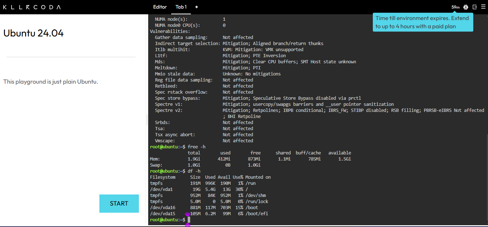
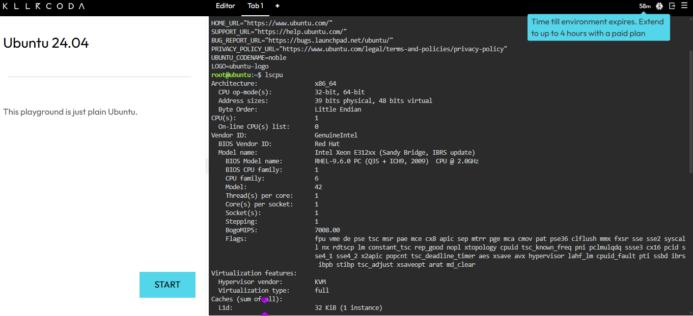

# Laboratory 03: Multi-Cloud Explorer & Linux Environment Investigation

## Project Overview
This repository serves as a comprehensive multi-cloud research documentation portfolio for "CloudNova Technologies". It evaluates the core services, infrastructure, and strategic alignment of the top three public cloud providers: Amazon Web Services (AWS), Microsoft Azure, and Google Cloud Platform (GCP).

## Repository Structure
* `aws-research.md` - In-depth breakdown of AWS architecture and services.
* `azure-research.md` - In-depth breakdown of Azure platform and integrations.
* `gcp-research.md` - In-depth breakdown of Google Cloud Platform and AI capabilities.
* `cloud-platform-comparison.md` - Platform matrix and equivalent service mapping.
* `client-recommendations.md` - Client scenario analysis and decision matrix.
* `reflection.md` - Personal reflection on business-driven cloud selection.
* `screenshots/` - Visual assets and terminal verification screenshots.

## Linux System Investigation (KillerCoda)

### Terminal Screenshot

### System Commands Output
* **OS Information (`cat /etc/os-release`)**: Identifies the running Linux distribution and version (Ubuntu/Debian).
* **CPU Architecture (`lscpu`)**: Displays processor architecture, core counts, and CPU vendor details.
* **Memory Usage (`free -h`)**: Shows total, used, and available system RAM in human-readable units.
* **Disk Usage (`df -h`)**: Reports mounted file systems, partition capacities, and available storage space.

### Cloud Hosting Analysis
This Linux server environment can be hosted seamlessly across all major cloud providers using their entry-level Virtual Machine (VM) compute services:
* **AWS**: Amazon EC2 (Elastic Compute Cloud)
* **Azure**: Azure Virtual Machines
* **GCP**: Google Compute Engine (GCE)
