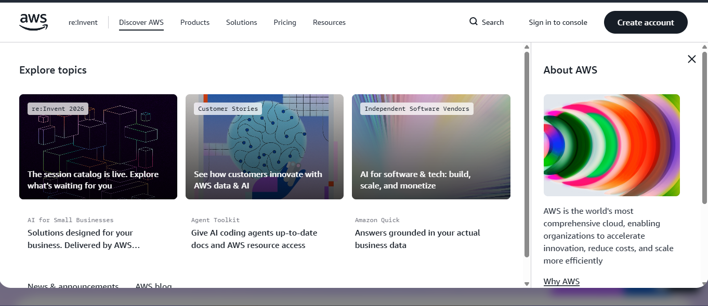

# AWS Research & Platform Overview

## Brief Overview
Amazon Web Services (AWS) is a comprehensive and broadly adopted cloud platform provided by Amazon. Launched in 2006, it offers over 200 fully featured services from data centers globally, catering to individuals, enterprises, and governments.

## Global Infrastructure
AWS global infrastructure is built around **AWS Regions** and **Availability Zones (AZs)**. 
* **Regions**: Physical geographic locations around the world where AWS clusters data centers.
* **Availability Zones**: Each Region consists of multiple, isolated, and physically separate AZs with independent power, cooling, and networking.
* AWS operates over 35+ geographic regions with more than 100+ Availability Zones globally.

## Cloud Management Console
The **AWS Management Console** is a web-based portal that allows users to access, build, and manage their cloud resources. It provides intuitive dashboards, a mobile management app, and integrated tools like AWS CloudShell for command-line access directly from the browser.

## Core Services
1. **Compute**: **Amazon EC2** (Elastic Compute Cloud) – Provides scalable virtual servers in the cloud.
2. **Storage**: **Amazon S3** (Simple Storage Service) – Highly durable object storage for data and backup.
3. **Database**: **Amazon RDS** (Relational Database Service) – Managed relational databases for MySQL, PostgreSQL, etc.
4. **Networking**: **Amazon VPC** (Virtual Private Cloud) – Provision isolated virtual network environments.

## Key Advantages
* **Market Pioneer & First-Mover Advantage**: Largest ecosystem and broadest toolset available in public cloud.
* **High Reliability & Scalability**: Multi-AZ architecture ensures high availability and fault tolerance.
* **Flexible Pricing**: Pay-as-you-go model with reserved instance savings and free tier offerings.

## Enterprise Use Cases
* **Web Hosting & E-Commerce**: Powering high-traffic retail websites with auto-scaling compute capacity.
* **Big Data & Analytics**: Running large-scale data lakes and streaming analytics using AWS EMR and Redshift.
