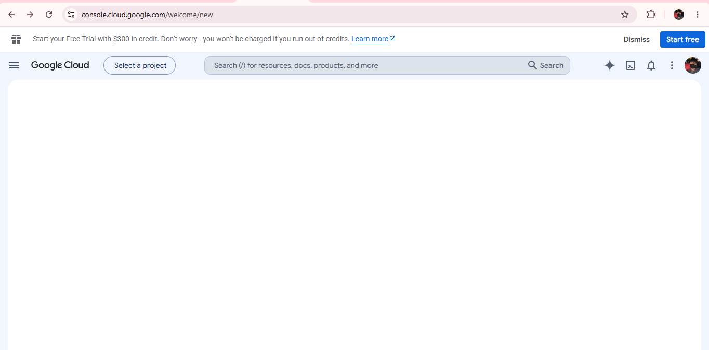

# Google Cloud Platform (GCP) Research & Platform Overview

## Brief Overview
Google Cloud Platform (GCP) is a suite of cloud services offered by Google. Built on the same infrastructure Google uses internally for Search and YouTube, GCP excels in big data, machine learning, and containerization.

## Global Infrastructure
GCP is connected by Google’s private high-speed global fiber network:
* **Regions**: Independent geographic locations hosting cloud resources (over 40+ regions globally).
* **Zones**: Deployment areas within regions that represent isolated clusters of data centers.
* **Edge Locations**: Over 200+ network edge locations delivering fast content through caching.

## Cloud Management Console
The **Google Cloud Console** provides a modern, clean web portal for managing GCP project resources. It features a built-in Cloud Shell environment, resource monitoring, and fast organization-level project grouping.

## Core Services
1. **Compute**: **Google Compute Engine (GCE)** – High-performance virtual machines.
2. **Storage**: **Google Cloud Storage** – Unified, scalable object storage.
3. **Database**: **Cloud Bigtable** / **Cloud Spanner** – Enterprise NoSQL and globally distributed relational databases.
4. **Networking**: **Google Cloud VPC** – Global, software-defined networking capabilities.

## Key Advantages
* **Industry-Leading AI & Data Analytics**: Superior native tools like BigQuery, Vertex AI, and TensorFlow support.
* **Kubernetes & Container Leadership**: Created Kubernetes (Google Kubernetes Engine / GKE offers top-tier container management).
* **Global Fiber Network**: Ultra-low latency through Google's custom private private network backbone.

## Enterprise Use Cases
* **Big Data & Real-Time Analytics**: Analyzing terabytes of data in seconds using BigQuery.
* **Machine Learning & AI Development**: Training and deploying AI/ML models on custom Google TPU hardware.
